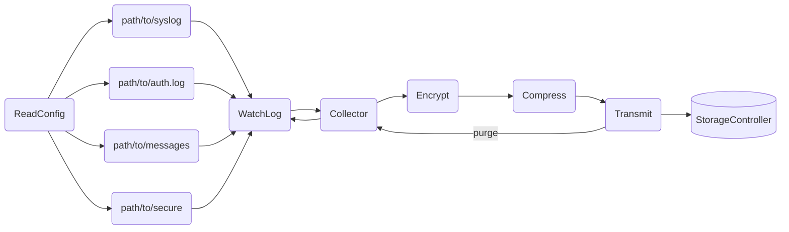
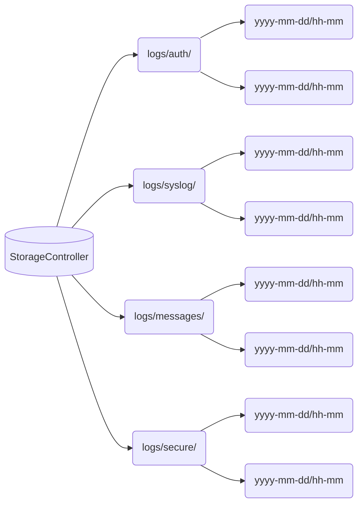

# WatchLog

# Table of Contents:

- [Overview](#overview)
- [Installation](#installation)
- [Configuration](#configuration)
- [Usage](#usage)
- [Architecture](#architecture)
- [Data Types](#data-types)

## Overview:
System Event Management Software should allow users to capture system and application activity while owning their data. By collecting system and application events using a simple and cost-efficient solution, users can monitor the health of their digital assets.

## Installation:

### Prebuilds
(not ready) curl --proto '=https' --tlsv1.2 -sSf https://sh.endepointe.com | bash

### Building from source:
To build from source, clone the repository and run the following commands:

```bash
git clone https://github.com/endepointe/watchlog.git
cd watchlog/app
cargo build --bin watchlog --release
```

#### Running the client:

To run the client, add the following to your systemd unit file:

```bash
ExecStart=bin/bash -c 'path/to/watchlog/app/target/release/watchlog'
```

#### Generate public and private keys:

```bash
./target/release/generate <private_key_file> <public_key_file>
```

#### Running the server:

Install the server binary on the server machine:

```bash
git clone https://github.com/endepointe/watchlog.git
cd watchlog/app
cargo build --bin storage-controller --release
```

To run the server, add the following to your systemd unit file:

```bash
ExecStart=bin/bash -c 'path/to/watchlog/app/target/release/storage-controller'
```

## Configuration:


### Setting up the logs:

To set up the logs to be collected, add desired log name(s) and path(s) to the `config.json` file:

```json
{
    "logs": [
        {
            "src": {
                "name": "<log_name>",
                "path": "path/to/log"
            },
            "dst": {
                "address": "..."
                "port": "..."
            },
            ...
            ...
            ...
        }
    ]
}
```

### Setting transmission buffer size:
To set the log collection buffer, set the ```tx_buffer``` value in `config.json` to one of the following:

| Interval | Description |
| --- | --- |
| 1kb | 1024 bytes |
| 4kb | 4096 bytes |
| 1mb | 1024 kilobytes |
| stream | Stream the logs |

The default value is 1kb.


### Systemd Unit File:

To make changes to the systemd unit file (Client and Server):

Make a copy of the `/etc/systemd/system/watchlog.service` file. The following is an example of the default systemd unit file for a service that runs the watchlog service:


#### Client:
```bash
[Unit]
Description=WatchLog Service - WatchLog

[Service]
ExecStart=bin/bash -c 'path/to/watchlog'
WorkingDirectory=path/to
StandardOutput=journal

[Install]
WantedBy=multi-user.target
```

#### Server:
```bash
[Unit]
Description=WatchLog Service - Storage Controller

[Service]
ExecStart=bin/bash -c 'path/to/storage-controller'
WorkingDirectory=path/to
StandardOutput=journal

[Install]
WantedBy=multi-user.target
```

## Usage:
After installation and configuration, start the service using the following command:

systemctl enable watchlog.service
systemctl start watchlog.service

To check the status of the service, use the following command:

systemctl status watchlog.service

Good to go.


## Architecture

#### Client



#### Server


### Data Types

<table>
<tr>
<td>Config</td>
<td>Defaults</td>
<td>Log</td>
</tr>
<tr>
<td>

```rust

struct Config {
    logs: Vec<Log>,
    defaults: Defaults,
}
```
</td>
<td>

```rust

struct Defaults {
    compression_level: u8,
    key: String,
    tx_buffer: String,
}
```
</td>
<td>

```rust

struct Log {
   src: Source,
   dst: Destination,
   compression_level: Option<u8>,
   key: Option<String>,
   tx_buffer: Option<String>,
```
</td>
</tr>
<tr>
<td>Source</td>
<td>Destination</td>
</tr>
<tr>
<td>

```rust

struct Source {
    name: String,
    path: String,
}
```
</td>
<td>

```rust

struct Destination {
    address: IpV4Addr or IpV6Addr,
    port: u16,
}
```
</td>
</tr>
</table>
