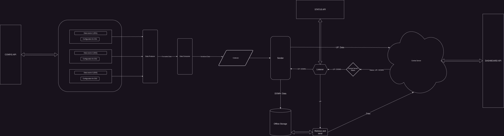

# Product Requirements README

## Table of Contents

1. [Problem Statement](#problem-statement)
2. [Goals and Objectives](#goals-and-objectives)
3. [User Type and Scenarios](#user-personas-and-scenarios)
4. [Functional Requirements](#functional-requirements)
5. [Non-functional Requirements](#non-functional-requirements)
6. [Visual Representations](#visual-representations)
7. [User Experience and Usability Plan](#user-experience-and-usability-plan)
8. [Technical Architecture and Choices](#technical-architecture-and-choices)
9. [Timeline](#timeline)
10. [Dependencies and Bottlenecks](#dependencies-and-bottlenecks)
11. [Testing and Quality Assurance](#testing-and-quality-assurance)
13. [User Documentation and Support](#user-documentation-and-support)
14. [Versioning](#versioning)
15. [Feasibility](#feasibility)
16. [Innovative Features](#innovative-features)
17. [Stakeholder Alignment](#stakeholder-alignment)
18. [Change Management](#change-management)
19. [Evaluation](#evaluation)

---

## Problem Statement

Gathering data from arbitrary log sources should not be a time-consuming task.
Blueteams, network admins, and anyone wanting to record and store the events 
of a service should have an efficient, secure method of doing so.

---

## Goals and Objectives

A stream of log events, provided by the client endpoint, will be packaged and
transported to a central cloud server for storage and retrieval. 

Whether on a windows or \*Nix-based endpoint, a user will be able to create an
account, receive proper credentials, and establish a secure connection between
the source of their logs and the central data-storage server.

Compatibility with ElasticSearch should be available to the user that will
complement the service the central storage server provides.

<a href="#table-of-contents" style="font-size: smaller;">back to top</a>

---

## User Type and Scenarios
| **User**           | **Scenario** | **Priority** |
|--------------------|--------------|--------------|
| *Security Analyst* | As a security analyst, I want to be able to specify relevant log sources for my investigations. |  High   |
| *IT Adminstrator*  | As an IT admin, I want an intuitive interface for configuring, initializing, and retrieving log data. | High | 
| *Network Administrator* | As a Network admin, I want the retrieval of network-related logs to be supported for network analysis. | High |

<a href="#table-of-contents" style="font-size: smaller;">back to top</a>

---

## Functional Requirements

1. **Data Collection:**
    - The system should be able to collect data from the specified source.
    - Specify supported data formats for efficient data parsing.

2. **TLS Connection Establishment:**
    - Implement TLS over TCP socket creation and management.
    - Create, Update, and Revoke certificates with an in-house CA manager

3. **Data Processing and Serialization:**
    - The collected data should be processed and serialized for transmission over the TCP connection.

4. **Error Handling and Reliability:**
    - Implement error detection and correction mechanisms.
    - TCP handles retransmission of lost or corrupted data.
    - Implement system monitoring and alerting to reduce downtime during system degradation

5. **Destination Data Reception:**
    - Develop a system of database I/O.
    - Create a procedure to integrate with ElasticSearch.
      
6. **User Authentication:**
    - Whitelist specific user IP addresses.
    - Key-value store mapping users to certificates.
    - Mechanism for revoking certificates if needed.
    - Create keys for the user to match certificate values.

<a href="#table-of-contents" style="font-size: smaller;">back to top</a>

---

## Non-functional Requirements
1. **Latency**
    - Response times should be less than 300ms
    - Support a 50% increase in log traffic
2. **Recovery**
    - Failure recovery without data loss
3. **Compatibility and Compliance**
    - WCAG compliant
    - Data protection compliant
    - Device and system agnostic (windows/\*nix)
4. **Documentation**
    - User and developer documentation
5. **Availability and Maintenance**
    - 24/7 availability, except during scheduled maintenance periods
6. **Installability (server/client components)**
    - Easy to perform, fast, and well explained through documentation 

<a href="#table-of-contents" style="font-size: smaller;">back to top</a>

---

## Visual Representations

<a href="#table-of-contents" style="font-size: smaller;">back to top</a>

---

## User Experience and Usability Plan

A first-time user will navigate to the product page (frontend repo) read about
the product software, and make a decision about whether this service fits their
needs. If their needs can be met with service provided, they will create an
account and be redirected to their account dashboard.

From their account dashboard, they will be able to:
- download their certificate and private key
- download the sofware along with the license
- copy their one-time-password (OTP) information (important)
- view existing log sources (not the data) being collected

The user will install the software (Tauri app) onto their machine.

When that process is complete, they will run the binary (doubleclick/cli) and be
presented with a login screen where they will enter their OTP (or user/pass).

When they have successfully authenticated, full visibility of log data will be 
available. The user will be able to interact with each log source, download their
data from the central server, and add/remove log sources.

We will make every attempt to ensure compatibility with users with disabilities
as the project progresses.

<a href="#table-of-contents" style="font-size: smaller;">back to top</a>

---

## Technical Architecture and Choices

The service running on the client machine will be written in Rust. The interface 
for client machines will be written using Tauri, another Rust-based project.

The reason for Rust being its ability to write and compile to multiple 
operating systems and handle threading and async operations. Along with its 
platform versatility, Rust's *cargo* command line tool has options for testing 
and documentation generation.

Tauri makes GUI creation simple. Given its cross-platform compatibility, due to
it being written in Rust, just makes sense.

The service running on the server will be a mix of languages, such as Terraform,
shell, Python, and Rust if needed. A relational database will be used, with
options left open to the user for integration with ElasticSearch if they choose.

The website provides the user signup, software distribution, and documentation
will use Svelte. 

<a href="#table-of-contents" style="font-size: smaller;">back to top</a>

---

## Timeline

An MVP of this service should be up and running at month 3. This will give 4
months for user testing/additional development.

<a href="#table-of-contents" style="font-size: smaller;">back to top</a>

---

## Dependencies and Bottlenecks

Still todo but: team size, creating the in-house CA, using Rust

<a href="#table-of-contents" style="font-size: smaller;">back to top</a>

---

## Testing and Quality Assurance

Between now and the 7th month, code and methods will be tested on a regular basis
as outlined in the SDP document [PROVIDE LINK TO SDP README].

### Test Conditions to be met:

#### API Repo:
- **All API endpoints:**
    1. Protect API endpoints through access verification

- **Public Key Infrastructure API endpoint must handle the following:**
    1. Issue certificates
    2. Verify the identity of the requesting user requesting a digital signature 
    3. Revoke certificates of specific users
    4. Renew certificates of specific users
    5. Key Pair storage and retrieval
    6. Certificate policy (cert lifetime, validation, key length reqs, etc.)
    7. Follows industry standards (x509, bitlength, cipher type, etc.)
    8. PKI audit logging
    9. PKI hierarchy (masterkey -> prodkey1 -> [prodkey2, ..., prodkeyN])
    10. Failure Recovery (offline masterkey) 

- **User management api endpoints must handle the following:**
    1. Create, Read, Update, and Delete users
    2. Account management (signin/out/delete,cert retrieval/renewal, etc.)
    3. Grant or revoke user certification.
    4. Whitelist specific IP addresses.
    5. Key-value to certificate matching for user authentication.

- **Dashboard api endpoints must handle the following:**
    1. Data visualization 

- **Software distribution api endpoints must handle the following:**
    1. Provide links to download software for existing platforms

#### Frontend Repo:
1. Provide the interface to interact with the API
2. Device agnostic
3. Contains links to User and Developer documentation

#### Server Repo:
1. Create a TLS connection with Client
2. Create a database specific to the user
3. Each user database has a table for each input log source
4. Delete database on user deletion
5. Automate the initialization of Server Instance

#### Client Repo:
1. Create a TLS connection with Server 
2. Command line and Graphical User Interface to configure:
    - the destination address
    - certificate (supplied from API repo)
    - path(s) to log source(s)

#### Documentation Repo:
1. Provides setup instructions for:
    - account management
    - certificate management
    - client-server connection establishment
2. Establish a [Changelog](SUPPLY LINK TO CHANGELOG)
3. Continuous Documentation Deployment here: https://securitylogminer-doc-repo.readthedocs.io/en/latest/

<a href="#table-of-contents" style="font-size: smaller;">back to top</a>

---

## User Documentation and Support
User documentation will be written to satisfy the requirements of the 
[documentation requirement section](#documentation-repo)

Support for this project will come as new maintainers are added to the
organization. Since this is an open-source project, forks will be possible under
the allowed [license](PROVIDE LINK TO SOFTWARE LICENSE).

Documentation is setup and hosted on Read The Docs. This type of integration allows for continuous updates to the documentation, whenever a development change occurs. Whenever updates are pushed to our documentation repository on GitHub, Read the Docs automatically rebuilds the documentation, ensuring that users always have access to the most current information. 

Linked documentation: https://securitylogminer-doc-repo.readthedocs.io/en/latest/

<a href="#table-of-contents" style="font-size: smaller;">back to top</a>

---

## Versioning

- **Major**: breaking changes
- **Minor**: new features
- **Patch**: bug fixes

Stable versions will be available on the Minor versions due to feature
availability.

<a href="#table-of-contents" style="font-size: smaller;">back to top</a>

---

## Feasibility

The initial team tasked with this project is capable but we recognize that this
will be a considerable amount of work. A minimal viable product is not past
realistic expectations.

<a href="#table-of-contents" style="font-size: smaller;">back to top</a>

---

## Innovative Features

There are no features that exist within this project that do not exist elsewhere.
What makes this product stand out is its availability on platforms. The service it
provides could pave the way for innovative services due the product's core data
collection service.

<a href="#table-of-contents" style="font-size: smaller;">back to top</a>

---

## Stakeholder Alignment

Stakeholder approves of overall project vision. 

<a href="#table-of-contents" style="font-size: smaller;">back to top</a>

---

## Change Management

Updates to software will be accompanied by a 
[Changelog](SUPPLY LINK TO CHANGELOG).

<a href="#table-of-contents" style="font-size: smaller;">back to top</a>

---

## Evaluation

The success of this product will be determined by satisfying the defined 
[testing conditions](#testing-and-quality-assurance).

<a href="#table-of-contents" style="font-size: smaller;">back to top</a>

