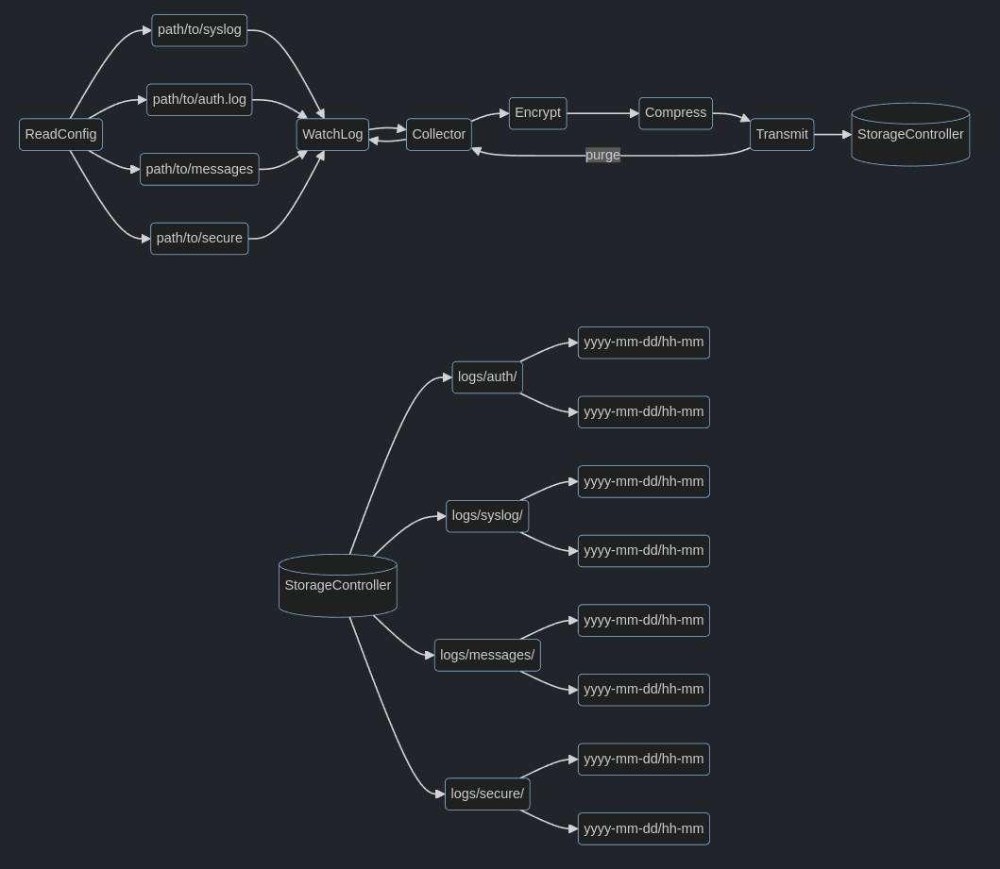

# Product Requirements Document

## Table of Contents

1. [Problem Statement](#problem-statement)
2. [Goals and Objectives](#goals-and-objectives)
3. [User Type and Scenarios](#user-personas-and-scenarios)
4. [Functional Requirements](#functional-requirements)
5. [Non-functional Requirements](#non-functional-requirements)
6. [Visual Representations](#visual-representations)
7. [User Experience and Usability Plan](#user-experience-and-usability-plan)
8. [Technical Architecture and Choices](#technical-architecture-and-choices)
9. [Timeline](#timeline)
10. [Dependencies and Bottlenecks](#dependencies-and-bottlenecks)
11. [Testing and Quality Assurance](#testing-and-quality-assurance)
13. [User Documentation and Support](#user-documentation-and-support)
14. [Versioning](#versioning)
15. [Feasibility](#feasibility)
16. [Innovative Features](#innovative-features)
17. [Stakeholder Alignment](#stakeholder-alignment)
18. [Change Management](#change-management)
19. [Evaluation](#evaluation)

## Problem Statement

Gathering data from arbitrary log sources should not be a time-consuming task.
Blueteams, network admins, and anyone wanting to record and store the events 
of a service should have an efficient, secure method of doing so.

## Goals and Objectives

A stream of log events, provided by the client endpoint, will be packaged and
transported to a central server for storage and retrieval. 

Users will be able to establish a secure connection between
the source of their logs and the central storage-controller.

[back to top](#table-of-contents)

## User Type and Scenarios
| **User**           | **Scenario** | **Priority** |
|-----------------|--------------|--------------|
| *Security Analyst* | As a security analyst, I want to be able to specify relevant log sources for my investigations. |  High   |
| *IT Adminstrator*  | As an IT admin, I want an intuitive interface for configuring, initializing, and retrieving log data. | High | 
| *Network Administrator* | As a Network admin, I want the retrieval of network-related logs to be supported for network analysis. | High |

[back to top](#table-of-contents)

## Functional Requirements

1. **Data Collection:**
    - The system should be able to collect data from the specified source.

2. **TLS Connection Establishment:**
    - Implement TLS over TCP socket creation and management.
    - Create, Update, and Revoke certificates with an CA manager

3. **Data Processing and Serialization:**
    - The collected data should be processed and serialized for transmission over the TCP connection.

4. **Error Handling and Reliability:**
    - Implement error detection and correction mechanisms.
    - TCP handles retransmission of lost or corrupted data.
    - Implement system monitoring and alerting to reduce downtime during system degradation

5. **Destination Data Reception:**
    - Develop a directory structure to receive logs (date and time).
      
[back to top](#table-of-contents)

## Non-functional Requirements
1. **Latency**
    - Response times should be less than 300ms
    - Support a 50% increase in log traffic
2. **Recovery**
    - Failure recovery without data loss
3. **Compatibility and Compliance**
    - Data protection compliant
    - Device and system agnostic (Windows, MacOS, Linux)
4. **Documentation**
    - User and developer documentation
5. **Availability and Maintenance**
    - Pull requests and issues addressed by maintainers within 24 hours
6. **Installability (server/client components)**
    - Easy to perform, fast, and well explained through documentation 

[back to top](#table-of-contents)

## Visual Representations

[back to top](#table-of-contents)

## User Experience and Usability Plan

A first-time user will navigate to the repo, read about
the product software, and make a decision about whether this service fits their
needs. If their needs can be met with service provided, they will install the software.

When that process is complete, they will run the binary. 

When they have successfully run the binary, log data will be fed to the storage-controller.
From the storage-controller server, the user will be able to interact with each log source, 
download their data from the central server, and add/remove log sources.

[back to top](#table-of-contents)

## Technical Architecture and Choices

The service running on the client and server machines will be written in Rust. 
A command-line interface will be available for client and server.

The reason for Rust being its ability to write and compile to multiple 
operating systems and handle threading and async operations. Along with its 
platform versatility, Rust's *cargo* command line tool has options for testing 
and documentation generation.

[back to top](#table-of-contents)

## Timeline

An MVP of this service should be up and running at month 3. This will give 4
months for user testing/additional development.

[back to top](#table-of-contents)

## Dependencies and Bottlenecks

Team size

[back to top](#table-of-contents)

## Testing and Quality Assurance

Between now and the 7th month, code and methods will be tested on a regular basis.

### Test Conditions to be met:

#### Storage-Controller:
1. Setup directory structure for log storage
2. Load test server with log sources

#### Client:
1. Establish a connection with the server
2. Send log data to the server
3. Handle errors via logging 
4. Load test client with log sources
5. Header is added to every log event 
6. Transmission buffer is configurable

[back to top](#table-of-contents)

## User Documentation and Support

Linked documentation: https://github.com/endepointe/watchlog/tree/main 

[back to top](#table-of-contents)

## Versioning

- **Major**: breaking changes
- **Minor**: new features
- **Patch**: bug fixes

Stable versions will be available on the Minor versions due to feature
availability.

[back to top](#table-of-contents)

## Feasibility

This will be a considerable amount of work. A minimal viable product is not past
realistic expectations.

[back to top](#table-of-contents)

## Innovative Features

There are no features that exist within this project that do not exist elsewhere.
What makes this product stand out is its availability on platforms. The service it
provides could pave the way for innovative services due the product's core data
collection service.

[back to top](#table-of-contents)

## Stakeholder Alignment

Stakeholder approves of overall project vision. 

[back to top](#table-of-contents)

## Change Management

Release updates to software will be accompanied by a CHANGELOG.md file.

[back to top](#table-of-contents)

## Evaluation

The success of this product will be determined by satisfying the defined 
[testing conditions](#testing-and-quality-assurance).

[back to top](#table-of-contents)

