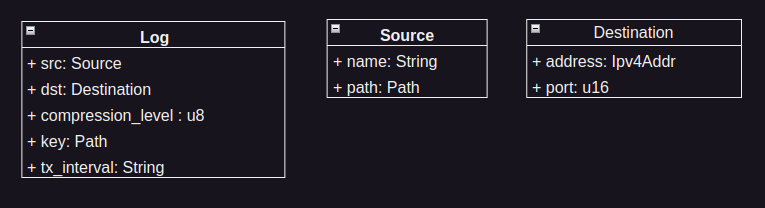

# Documentation

## Table of Contents

- [Configuration](#configuration)
- [Data Types](#data-types)

### Configuration
To make changed to the uystemd Unit File:

Make a copy of the `/etc/systemd/system/watch-log.service` file. The following is an example of the default systemd unit file for a service that runs the watch-log service:

```bash

[Unit]
Description=Watch-Log Service

[Service]
ExecStart=bin/bash -c 'path/to/watch-log > path/to/watch-log-health 2>&1'
WorkingDirectory=path/to
StandardOutput=journal

[Install]
WantedBy=multi-user.target
```


### Data Types


