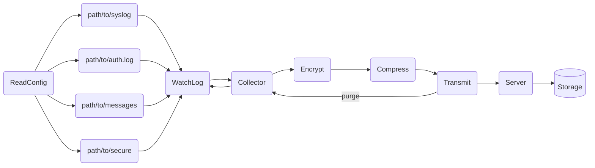

# Documentation

## Table of Contents
- [Architecture](#architecture)
- [Configuration](#configuration)
- [Data Types](#data-types)

### Architecture


### Configuration
To make changed to the systemd unit file:

Make a copy of the `/etc/systemd/system/watch-log.service` file. The following is an example of the default systemd unit file for a service that runs the watch-log service:

```bash

[Unit]
Description=WatchLog Service

[Service]
ExecStart=bin/bash -c 'path/to/watchlog'
WorkingDirectory=path/to
StandardOutput=journal

[Install]
WantedBy=multi-user.target
```


### Data Types

<table>
<tr>
<td>Config</td>
<td>Defaults</td>
<td>Log</td>
</tr>
<tr>
<td>

```rust

struct Config {
    logs: Vec<Log>,
    defaults: Defaults,
}
```
</td>
<td>

```rust

struct Defaults {
    compression_level: u8,
    key: String,
    tx_interval: String,
}
```
</td>
<td>

```rust

struct Log {
   src: Source,
   dst: Destination,
   compression_level: Option<u8>,
   key: Option<String>,
   tx_interval: Option<String>,
```
</td>
</tr>
<tr>
<td>Source</td>
<td>Destination</td>
</tr>
<tr>
<td>

```rust

struct Source {
    name: String,
    path: String,
}
```
</td>
<td>

```rust

struct Destination {
    address: IpV4Addr or IpV6Addr,
    port: u16,
}
```
</td>
</tr>
</table>


### Flow Chart

General flow chart of the application:


